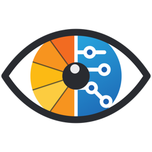

<div align="center">



# MirrorScopio

**Una parola compare per un lampo. Chi legge la dice ad alta voce. Il Mac ascolta e capisce da sé se è giusta.**

Un tachistoscopio per logopedia che non ha bisogno di un adulto che segni le risposte.

[](https://github.com/FightTheStroke/MirrorScopio/actions/workflows/verifica.yml)
[](https://github.com/FightTheStroke/MirrorScopio/releases/latest)
[](LICENSE)

[](#requisiti)
[](#requisiti)
[](#scaricare-e-usare)

[](https://github.com/FightTheStroke/MirrorScopio/discussions/1)
[](https://github.com/FightTheStroke/MirrorScopio/discussions/1)
[](https://github.com/FightTheStroke/MirrorScopio/discussions/2)

[](#privacy-la-promessa-e-come-la-manteniamo)
[](#licenza)
[](https://www.fightthestroke.org/donorbox)

Un progetto della **[Fight The Stroke Foundation](https://www.fightthestroke.org)**,
sorella di **[MirrorBuddy](https://github.com/FightTheStroke/MirrorBuddy)**.

[Scarica](#scaricare-e-usare) · [Com'è fatta](docs/ARCHITETTURA.md) · [Accessibilità](docs/ACCESSIBILITA.md) · [Parte clinica](docs/CLINICA.md) · [Roadmap mobile e store](roadmap.md) · [Contribuire](CONTRIBUTING.md)

</div>

> [!WARNING]
> **Epilessia fotosensibile.** La presentazione rapida comporta rapidi cambi di luminanza.
> Non usare con persone con epilessia fotosensibile senza parere medico.
>
> MirrorScopio è uno strumento di **esercizio e osservazione**, non un dispositivo medico:
> non produce diagnosi e non sostituisce il lavoro di un logopedista.

---

## Il problema

Il tachistoscopio è un esercizio classico nella riabilitazione della dislessia: mostri una
parola per pochi centesimi di secondo, poi la copri. Serve ad allenare la **lettura
globale** — riconoscere la parola tutta insieme invece di decifrarla lettera per lettera.

Funziona, ma ha un difetto pratico: **serve un adulto** che dopo ogni parola prema
"giusto" o "sbagliato". Il che vuol dire che si può fare solo in seduta, un'ora a
settimana, mentre l'esercizio darebbe il meglio se fatto pochi minuti al giorno.

## Che cosa fa MirrorScopio

| | |
|---|---|
| **Valuta da solo** | Il riconoscimento vocale gira interamente sul Mac. Nessuno deve premere niente: la parola lampeggia, il bambino la legge, l'app decide. |
| **Si adatta** | La velocità sale e scende inseguendo la soglia di chi legge. A fine sessione propone di cambiare livello se è stato troppo facile o troppo difficile. |
| **Non fa sentire nessuno stupido** | Difficile quanto basta per valere qualcosa, facile abbastanza da riuscirci. Punteggi nascondibili, festeggiamenti spegnibili. |
| **Non esce mai dal Mac** | Nessun account, nessun servizio, nessuna telemetria. L'unica cosa che passa dalla rete è il controllo della versione, che puoi tenere spento. |

### Due modalità

| | Che cosa succede | Che cosa allena |
|---|---|---|
| **Leggi** | Lampeggia una parola, la si legge ad alta voce | Lettura globale, ampiezza dello sguardo, velocità di riconoscimento |
| **Scrivi** | Il Mac detta una parola, la si scrive | Conversione suono → lettera, ortografia |

### Una sessione, dall'inizio alla fine

1. **Prepara il Mac** — al primo avvio l'app controlla da sola di avere quel che le serve
   (permesso del microfono, riconoscimento italiano, voce) e se manca qualcosa **lo
   scarica da sé**. Non si passa mai dalle Impostazioni di Sistema.
2. **Prova iniziale**, una volta sola — otto parole a velocità calante misurano da dove
   partire.
3. **Riscaldamento** — le prime parole restano visibili il triplo del tempo e non contano.
4. **Sessione** — croce di fissazione → parola → maschera → ascolto → esito. Tutto
   automatico, nessun tasto da premere.
5. **Risultato** — quante ne ha prese, quali sono scappate, stelle e obiettivi. Il
   dettaglio clinico (soglia, latenza vocale, tipo di errore, referto PDF) resta chiuso
   sotto *"Dettaglio per l'adulto"*.

### Se ti serve una mano

Dentro l'app, dal menu **Aiuto → «Aiuto di MirrorScopio»** (o con ⌘?), c'è una guida in
parole semplici: come funziona, le due modalità, che cosa fare se il Mac non sente, e una
pagina per chi accompagna. Dal menu si aprono anche le **Impostazioni** (⌘,), **I tuoi
progressi** (⌘P), la prova del microfono e la schermata «Prepara il Mac» — le stesse cose
che trovi con i pulsanti, per chi preferisce la tastiera. Durante una lettura queste voci
si spengono da sole, così nessuno esce da una sessione per sbaglio.

---

## Accessibilità: non un'aggiunta, il punto di partenza

Pensata per ragazzi con **dislessia, autismo, ADHD, ipovisione, paralisi cerebrale**.
Un **profilo** imposta tutto in un colpo solo; poi ogni singola manopola resta regolabile.

- **Caratteri** — OpenDyslexic, Atkinson Hyperlegible, Lexend, inclusi nell'app, più quelli
  di sistema. Spaziatura fra le lettere regolabile.
- **Temi** — chiaro, scuro, altissimo contrasto, carta color crema.
- **Daltonismo** — palette per deuteranopia, protanopia, tritanopia, monocromia. Giusto e
  «ancora» **non si distinguono mai solo dal colore**: c'è sempre anche un simbolo e una
  parola scritta.
- **Voce** — tutte le voci italiane del Mac in elenco, con anteprima all'ascolto e
  velocità regolabile.
- **Movimento** — ogni animazione si può togliere.
- **Calma** — modalità senza esclamazioni né festeggiamenti, per chi li vive come rumore.
- **Ansia da prestazione** — punteggi e percentuali nascondibili del tutto.
- **Pause automatiche** ogni N parole, senza conto alla rovescia.
- **Promemoria giornalieri** — un invito gentile all'ora che scegli, tutti i
  giorni o solo feriali, spegnibile. Tutto locale, mai un rimprovero, e niente
  se hai già letto le tue parole quel giorno.
- Tutto è grande, e ogni dimensione si moltiplica fino a ×2.

Le principali di queste scelte si incontrano **già al primo avvio**, con
un'anteprima dal vivo della parola, così chi accompagna il ragazzo capisce
subito se riuscirà a leggere — senza dover cercare nelle impostazioni.

Il perché di ogni scelta: [`docs/ACCESSIBILITA.md`](docs/ACCESSIBILITA.md).

---

## Privacy: la promessa, e come la manteniamo

**Niente che riguardi chi usa l'app esce da questo Mac.** Nessun account, nessuna
telemetria, nessun profilo, niente che si possa ricondurre a una persona.

- La voce viene trascritta dal **modello on-device** di macOS.
- L'analisi del tipo di errore usa i **Foundation Models di Apple**, che girano in locale.
  È facoltativa: senza Apple Intelligence l'app funziona uguale.
- I dati stanno in file JSON leggibili in `~/Library/Application Support/MirrorScopio/`.
  Per cancellare tutto, si butta quella cartella.
- I **promemoria giornalieri**, se li accendi, sono avvisi locali di macOS:
  compaiono su questo Mac e non mandano niente a nessuno.

Per onestà, le uniche tre cose che passano dalla rete:

1. Al primo avvio macOS **scarica** da Apple il modello di riconoscimento italiano — è un
   download del sistema operativo, non contiene dati tuoi, e succede una volta sola.
2. Il **controllo della versione**: una volta al giorno l'app può chiedere a GitHub qual è
   l'ultima versione pubblicata. Non manda niente, chiede e basta. Lo si accende
   nell'avvio guidato o dalle Impostazioni, ed è **spento finché non lo scegli**. Tutto il
   codice che tocca la rete sta in un file solo, [`Sources/Core/Updates.swift`](Sources/Core/Updates.swift),
   e un controllo automatico impedisce che ne compaia altrove.
3. Chi *pubblica* una versione manda l'app ad Apple per la firma di sicurezza.

Dettagli in [`SECURITY.md`](SECURITY.md).

---

## Scaricare e usare

Il modo semplice: **[scarica l'ultima versione](https://github.com/FightTheStroke/MirrorScopio/releases/latest)**,
apri il `.dmg`, trascina MirrorScopio in Applicazioni.

L'app è firmata dalla Fight The Stroke Foundation e **notarizzata da Apple**: si apre con
un doppio clic, senza avvisi e senza tasto destro.

### Requisiti

- **macOS 26** o successivo, Mac con Apple Silicon
- Un microfono, anche quello incorporato
- Circa 1 GB liberi per il modello vocale italiano, scaricato una volta sola dall'app
- Apple Intelligence **facoltativo**: senza, cambia solo il commento clinico sugli errori

<a id="windows-linux-web"></a>
### Altre piattaforme, altre lingue

**Non ancora.** MirrorScopio oggi esiste **solo per Mac** e parla **solo italiano**, e non
per pigrizia.

La parte difficile non è l'interfaccia: è la parola che compare per 80 millesimi di secondo
senza tremare, e il riconoscimento vocale che gira **dentro il Mac** senza mandare la voce
di un bambino sul server di qualcun altro. Oggi quelle due cose, insieme, le dà solo Apple.
E ogni lingua nuova non è un file di traduzioni: vuole **le sue liste di parole**, costruite
sulla frequenza e sulla struttura di quella lingua. È lavoro clinico, non lavoro di codice.

Prima di cominciare vogliamo sapere **per chi**. Bastano due clic:

| | |
|---|---|
| 🌍 **[In che lingua ti serve?](https://github.com/FightTheStroke/MirrorScopio/discussions/1)** | metti 👍 sulla tua lingua |
| 💻 **[Windows, Linux, iPad, browser?](https://github.com/FightTheStroke/MirrorScopio/discussions/2)** | metti 👍 sulla tua piattaforma |

Sono sondaggi aperti: i voti si vedono, li conta GitHub, **non c'è nessun modulo da
compilare e nessuno strumento che traccia chi passa**. Se puoi, aggiungi un commento con
*per chi* ti serve e *quante persone* la userebbero — un logopedista con trenta pazienti
conta più di trenta curiosi, ed è l'unica cosa che ci fa decidere da dove partire.

Senza account GitHub va bene lo stesso: 📬 **[info@fightthestroke.org](mailto:info@fightthestroke.org?subject=MirrorScopio%20in%20un%27altra%20lingua%20o%20piattaforma&body=Ciao%2C%0A%0AMi%20servirebbe%20MirrorScopio%20in%3A%20(lingua)%0ASu%3A%20(Mac%20%2F%20Windows%20%2F%20Linux%20%2F%20iPad%20%2F%20browser)%0A%0APer%20chi%3A%20(a%20casa%2C%20in%20studio%2C%20a%20scuola%2C%20altro)%0AQuante%20persone%20lo%20userebbero%3A%0A%0AAltro%20che%20vi%20serve%20sapere%3A%0A)** — il messaggio si apre già scritto, basta completarlo. Ci
arriva un'email normale. Non ti scriveremo per altro.

Chi sviluppa e vuole provarci davvero: il codice è Apache 2.0 e la logica clinica è
deliberatamente separata dall'interfaccia proprio per questo. Vedi
[`docs/ARCHITETTURA.md`](docs/ARCHITETTURA.md) e [`CONTRIBUTING.md`](CONTRIBUTING.md).

---

## Compilare, per chi sviluppa

```bash
git clone https://github.com/FightTheStroke/MirrorScopio.git
cd MirrorScopio
./build.sh                      # compila e firma
open build/MirrorScopio.app
./test.sh --all                 # tutte le verifiche
```

Non c'è un progetto Xcode ed **è voluto**: `build.sh` chiama `swiftc` direttamente, così il
progetto resta leggibile e compilabile senza aprire nulla. La firma usa il certificato
*Developer ID* della fondazione se è nel portachiavi, altrimenti ripiega su una firma
ad-hoc — un clone fresco compila su qualunque Mac.

### Pubblicare una versione

```bash
./scripts/release.sh 0.3.0
```

Aggiorna `VERSION`, chiude la sezione del changelog, marca il commit e lo spinge. Da lì in
poi **GitHub fa il resto**: compila su macOS 26, firma, manda l'app ad Apple per la
notarizzazione, verifica che Gatekeeper la accetti e allega il `.dmg` alla release.
Come si insegnano le chiavi a GitHub: [`docs/DISTRIBUZIONE.md`](docs/DISTRIBUZIONE.md).

---

## Documentazione

| Documento | Che cosa ci trovi |
|---|---|
| [`docs/ARCHITETTURA.md`](docs/ARCHITETTURA.md) | Com'è fatta dentro: macchina a stati, riconoscimento, dati |
| [`docs/ACCESSIBILITA.md`](docs/ACCESSIBILITA.md) | Ogni scelta inclusiva e il motivo per cui è stata fatta |
| [`docs/CLINICA.md`](docs/CLINICA.md) | Scala adattiva, soglia, latenza vocale, tipi di errore |
| [`docs/GAMIFICATION.md`](docs/GAMIFICATION.md) | Punti, serie, obiettivi — e perché si possono spegnere |
| [`docs/DISTRIBUZIONE.md`](docs/DISTRIBUZIONE.md) | Firma, notarizzazione, pacchetto, automazione su GitHub |
| [`roadmap.md`](roadmap.md) | Piano tracciabile per iPhone, iPad, TestFlight e App Store |
| [`CONTRIBUTING.md`](CONTRIBUTING.md) | Come si lavora qui e cosa non è negoziabile |
| [`SECURITY.md`](SECURITY.md) | Dove stanno i dati, come segnalare un problema |
| [`AGENTS.md`](AGENTS.md) | Istruzioni per chi ci lavora, umano o agente |
| [`CHANGELOG.md`](CHANGELOG.md) | Che cosa è cambiato, versione per versione |

---

## Stato del progetto

**0.x — giovane ma vera.** L'app si compila, si firma, si distribuisce e si usa. Le parti
delicate — riconoscimento vocale, scala adattiva, accessibilità — sono scritte e verificate;
quello che manca è **l'uso sul campo con logopedisti veri**, che è il prossimo passo.

Contributi benvenuti, soprattutto da chi fa questo mestiere: leggi
[`CONTRIBUTING.md`](CONTRIBUTING.md).

## Licenza

Codice sotto [Apache License 2.0](LICENSE) — vedi anche [`NOTICE`](NOTICE).
Caratteri sotto SIL Open Font License 1.1, vedi
[`Resources/Fonts/LICENSES.md`](Resources/Fonts/LICENSES.md).

<div align="center">

**[Fight The Stroke Foundation](https://www.fightthestroke.org)** — per i bambini con
una lesione cerebrale acquisita e le loro famiglie.

</div>
